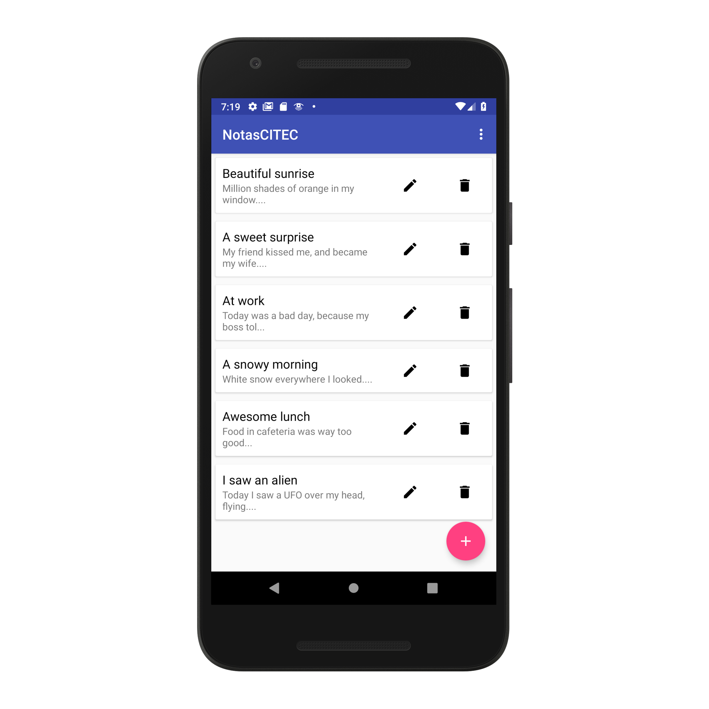

# NotasCITEC

Aplicación de notas para Android hecha con Kotlin que utiliza Firebase para autenticar usuarios y almacenar notas. Es la aplicación que se realizará en el taller de programación Android del CITEC 2018, un evento organizado por el Instituto Tecnológico de Celaya.

